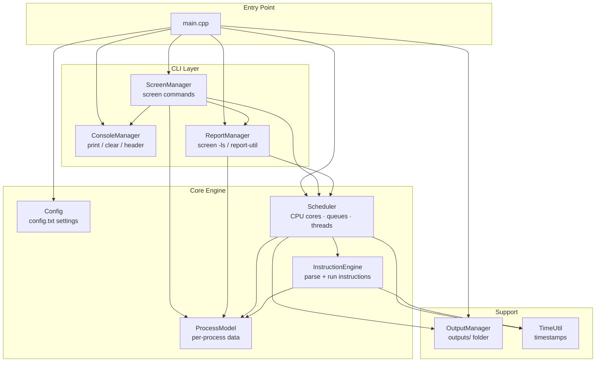
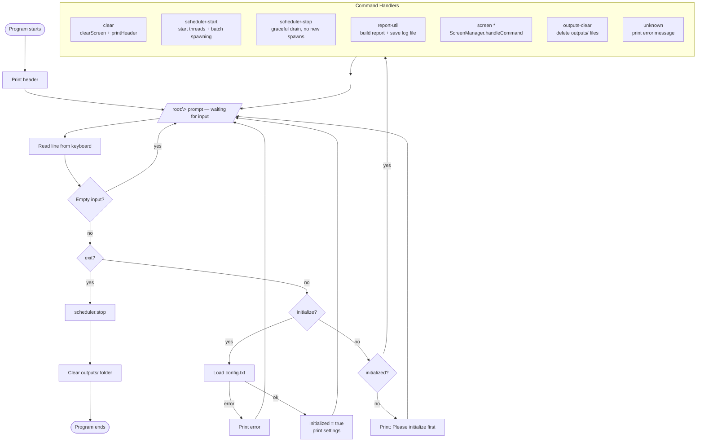

# A — System Overview

## A.1 High-Level Module Map

Shows every source file and how they depend on each other.
Arrow means "uses / calls".

---

## A.2 Full Command Flow (top-level)

What happens from the moment the user types a command to when the result appears.

