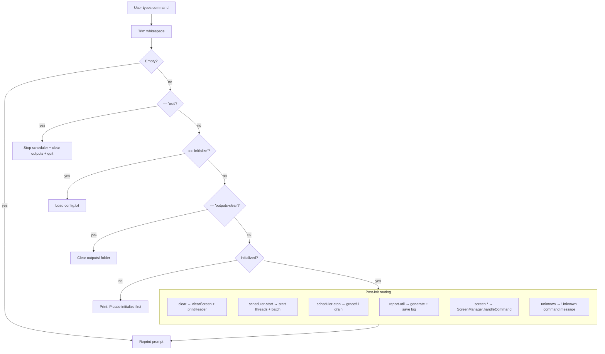

# B — Command Recognition

## Background

Command recognition is the first thing the system does when the user presses Enter.
Before any logic runs, the input string is trimmed of leading and trailing whitespace.
An empty string is silently ignored and the prompt is reprinted.

The system uses two recognition mechanisms:
- **Exact string match** — for commands with no variable arguments (e.g. `scheduler-start`, `clear`)
- **startsWith check** — for commands that carry a name argument after the flag (`screen -s <name>`, `screen -r <name>`)

Any input that does not match a known pattern falls through to an "Unknown command" message.

---

## Initialization Gate

A session-wide boolean flag `initialized` blocks most commands until `config.txt`
has been successfully loaded. Only three commands bypass this gate:

> `exit`, `initialize`, and `outputs-clear` work at any time.
> All other commands print "Please initialize the system first" until `initialize` is called.

---

## Command Reference Table

| Command | Match type | Requires initialize | Action |
|---|---|---|---|
| `exit` | exact | No | Stop scheduler, clear outputs/, quit |
| `initialize` | exact | No | Load and validate config.txt |
| `outputs-clear` | exact | No | Delete all files in outputs/ |
| `clear` | exact | Yes | Clear screen, reprint header |
| `scheduler-start` | exact | Yes | Start threads, enable batch spawning |
| `scheduler-stop` | exact | Yes | Graceful stop — no new spawns, drain queue |
| `report-util` | exact | Yes | Generate report, save to csopesy-log.txt |
| `screen` | exact | Yes | Print usage error (no subcommand given) |
| `screen -ls` | exact | Yes | Print CPU and process list to terminal |
| `screen -s <name>` | startsWith | Yes | Create new process, enter process screen |
| `screen -r <name>` | startsWith | Yes | Attach to existing running process |
| anything else | no match | — | Print: Unknown command. Please try again. |

---

## B.1 Full Command Routing Flow

