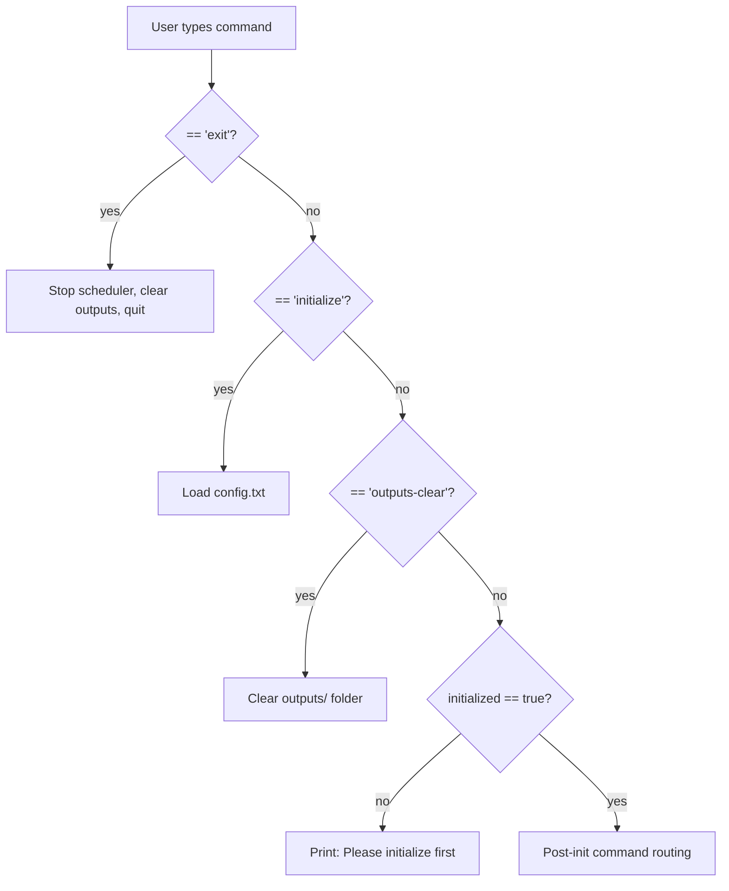
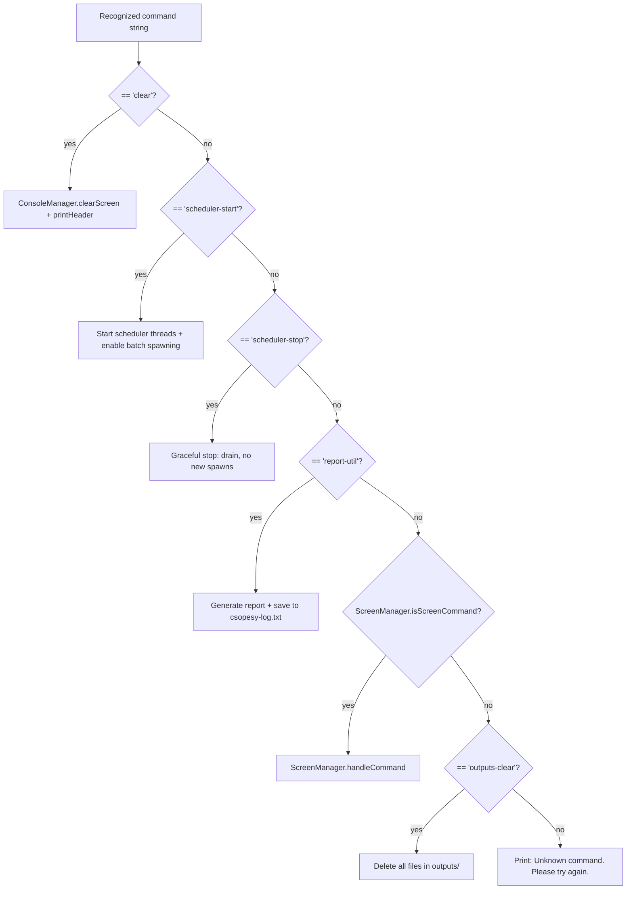
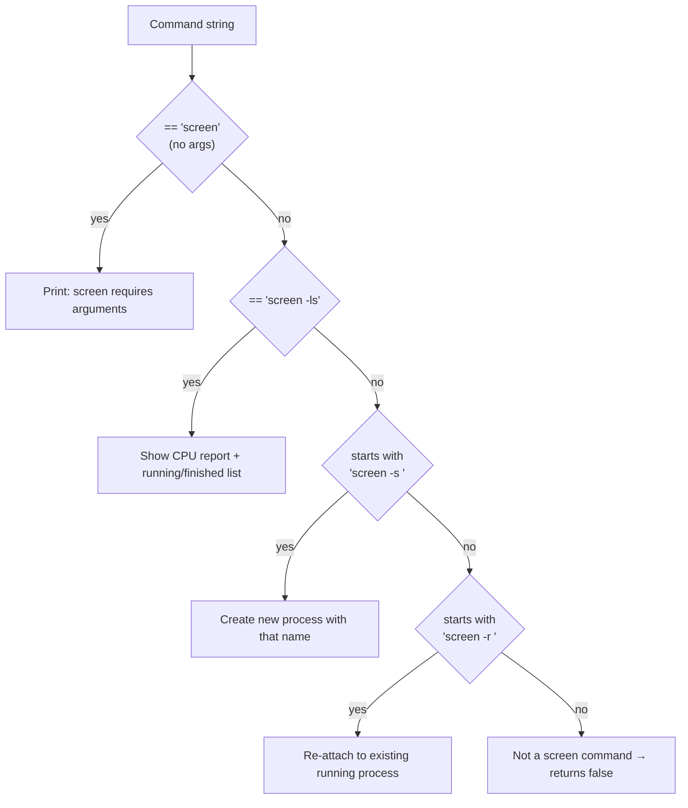

# B — Command Recognition

## B.1 Before Initialization Gate

Only two commands work before `initialize` is called.
All others are blocked with an error message.

---

## B.2 Post-Initialization Command Routing

After `initialize` succeeds, every recognized command has a dedicated handler.

---

## B.3 Screen Command Recognition Detail

`ScreenManager.isScreenCommand()` checks for four specific patterns
before `handleCommand()` dispatches to the right action.

