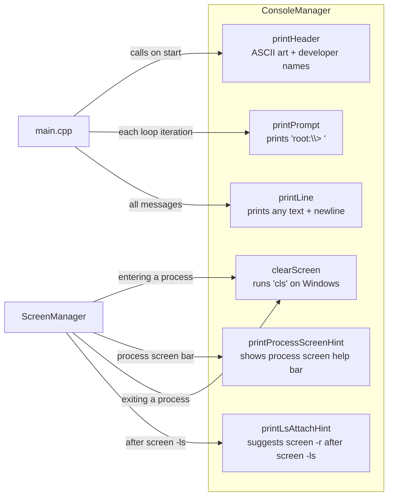
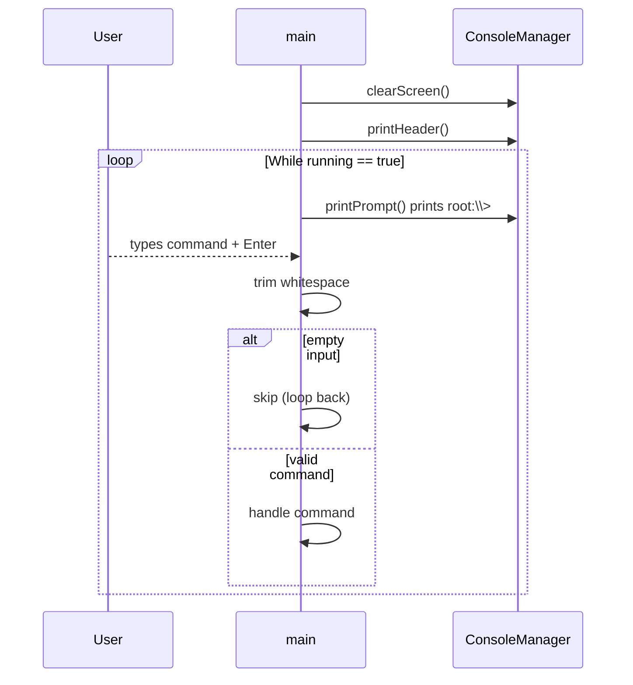
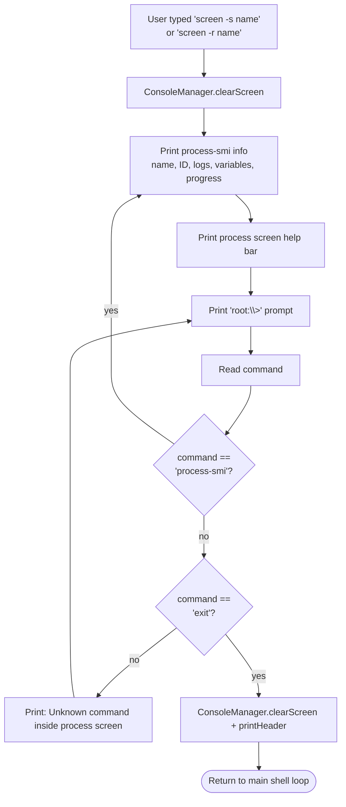

# C — Console UI Implementation

## C.1 ConsoleManager Responsibilities

ConsoleManager is a thin utility layer. It owns no state — it only
prints things to the terminal. Everything visual goes through here.

---

## C.2 Main Shell Loop (how UI stays alive)

The shell is a simple infinite loop. It never blocks in a busy spin —
`std::getline` parks the thread until the user presses Enter.

---

## C.3 Process Screen UI Loop

When the user enters a process screen (via screen -s or screen -r),
the outer shell loop is paused. A separate inner loop runs instead.
The user returns to the main menu by typing 'exit' inside the process screen.

