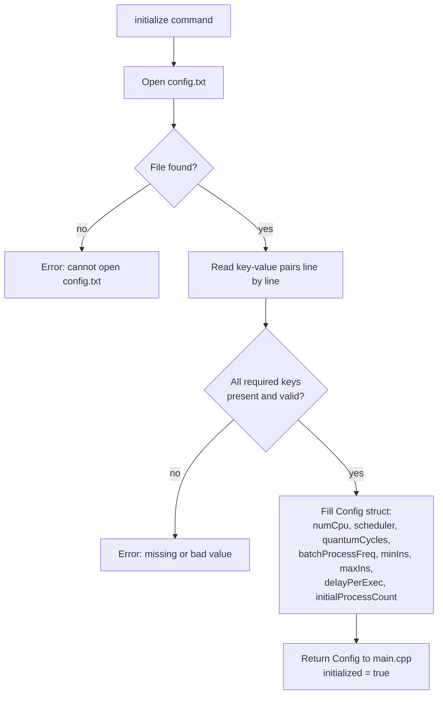
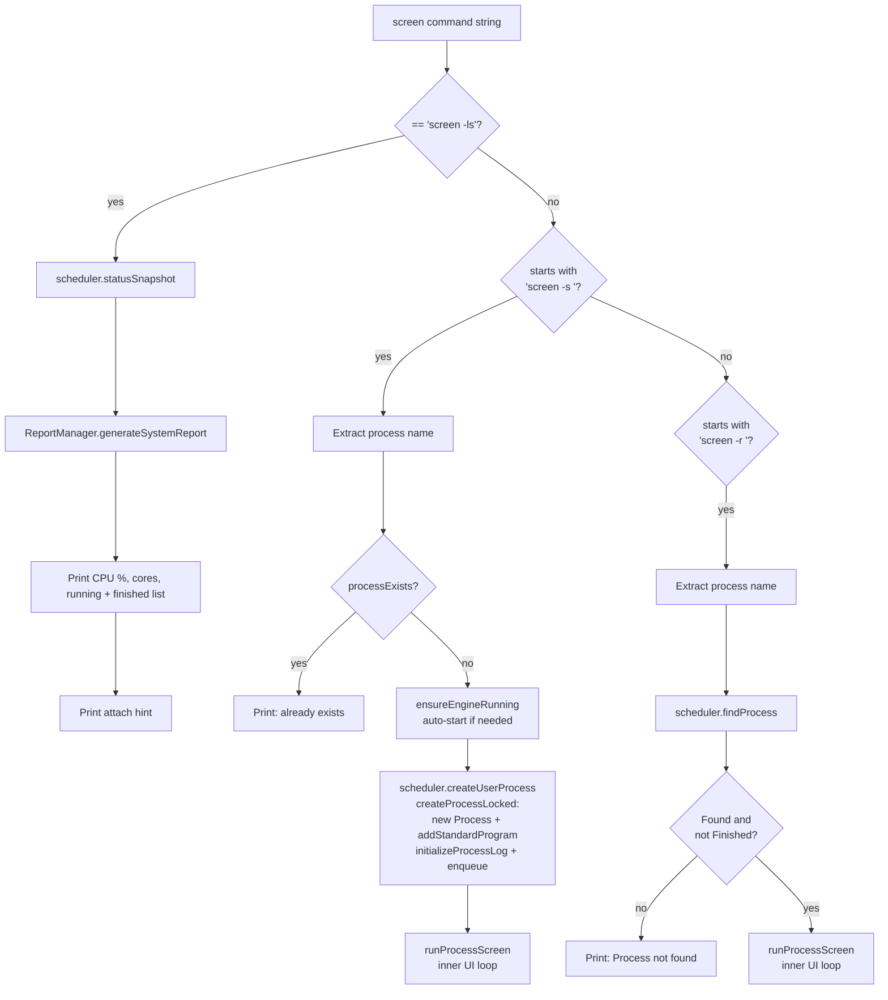
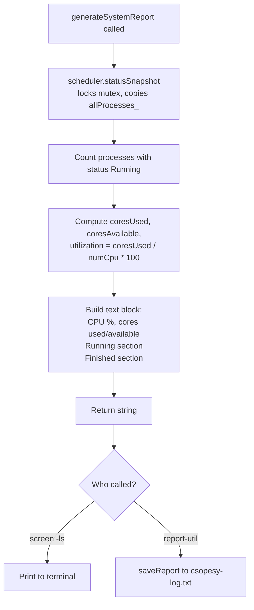

# D — Command Interpreter Implementation

## D.1 Config Loading (initialize command)

When the user types `initialize`, `ConfigLoader::loadFromFile` reads
`config.txt` and validates every field.

---

## D.2 ScreenManager.handleCommand Internals

Full decision tree showing what happens inside each screen sub-command.

---

## D.3 ReportManager: Generate System Report

`screen -ls` and `report-util` both call `generateSystemReport`.
The data is a snapshot so running threads do not interfere.

