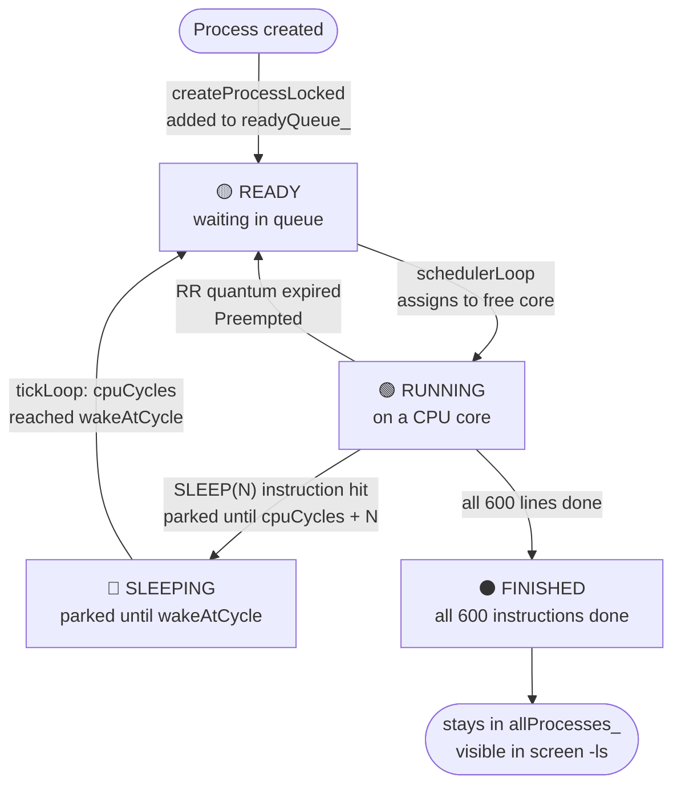
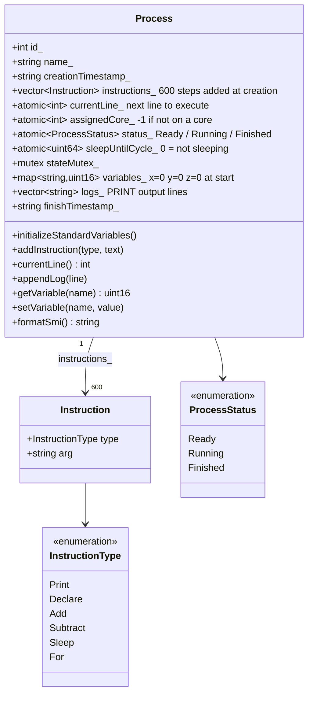
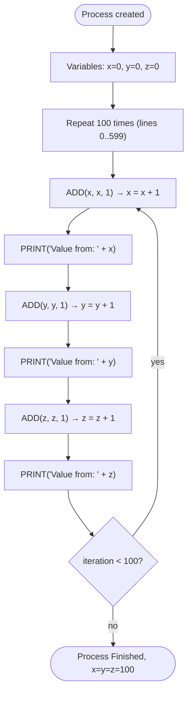
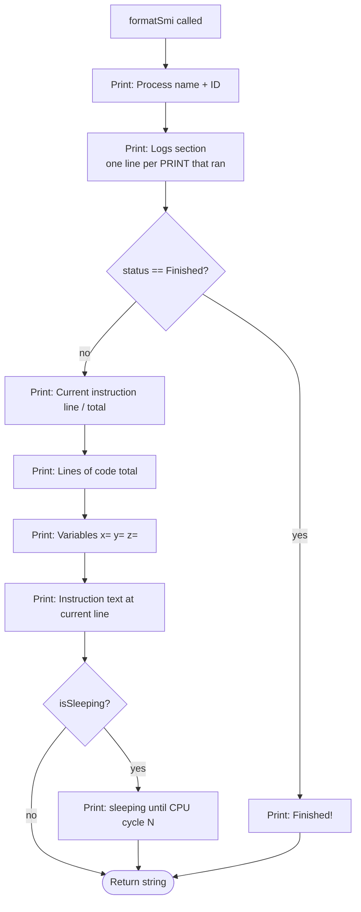

# E — Process Representation

## E.1 Process Lifecycle States

A process moves through three states from creation to completion.

---

## E.2 Process Data Structure

Everything the emulator tracks about one process.

---

## E.3 Standard Program: What Every Process Runs

`addStandardProgram()` builds the same 600-instruction program for every process.
x, y, z all start at 0 (set by `initializeStandardVariables`).

---

## E.4 process-smi Output Layout

`formatSmi()` assembles everything visible when the user is inside a process screen.

