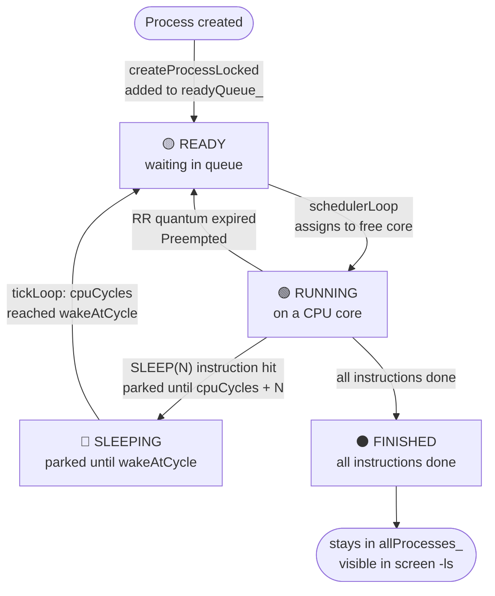
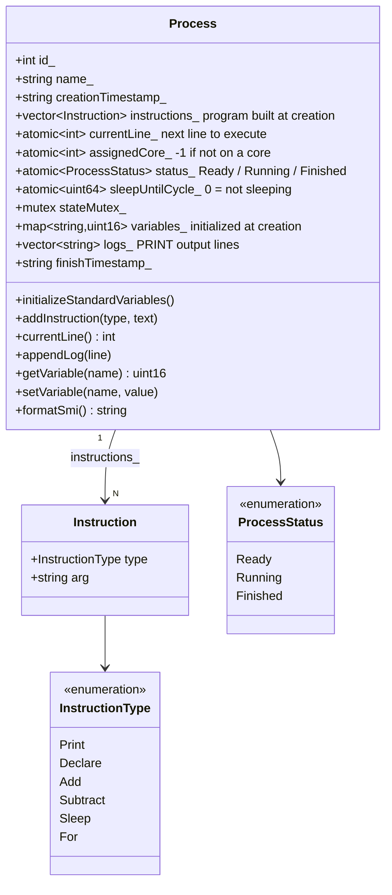
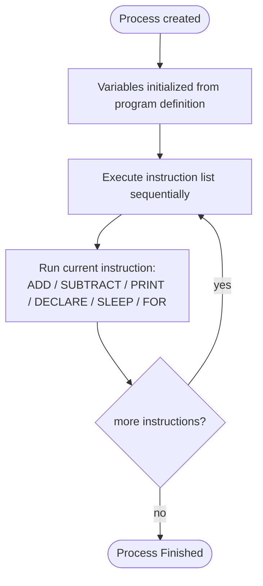
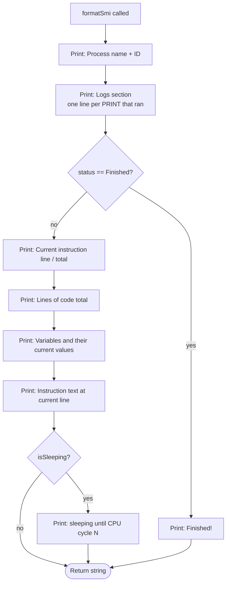

# E — Process Representation

## E.1 Process Lifecycle States

A process moves through three states from creation to completion.

---

## E.2 Process Data Structure

Everything the emulator tracks about one process.

---

## E.3 Process Program Execution

Every process has a list of instructions built at creation.
The core thread executes them sequentially until all are done.
Note: in this implementation, `addStandardProgram()` loads the same
test-case program into every process (ADD and PRINT on x, y, z variables).

---

## E.4 process-smi Output Layout

`formatSmi()` assembles everything visible when the user is inside a process screen.

