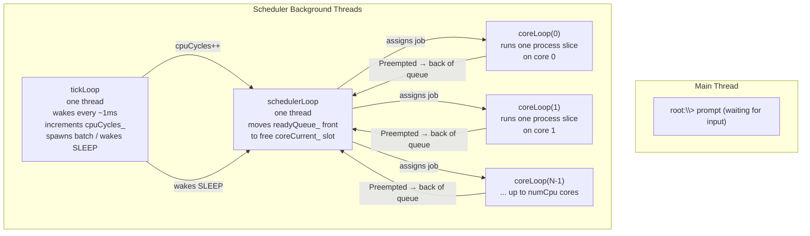
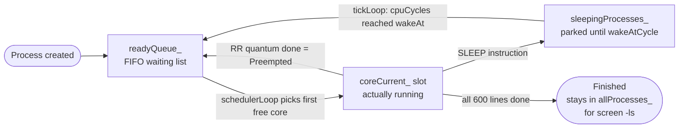
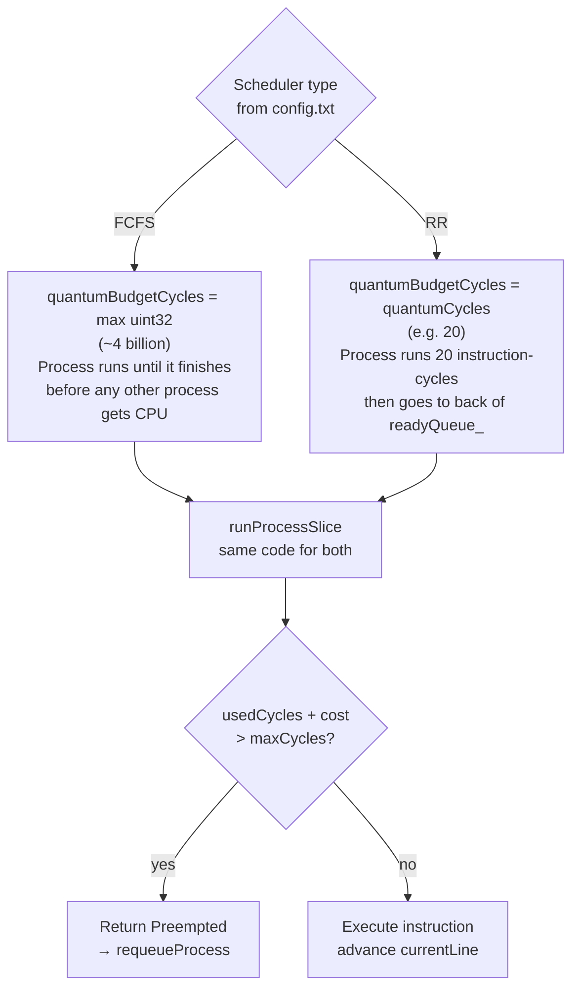
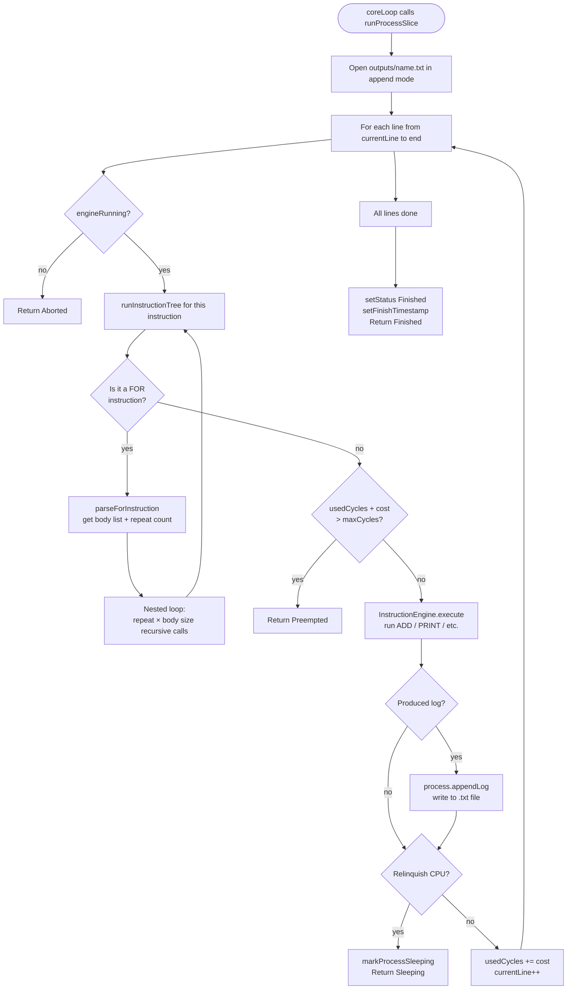
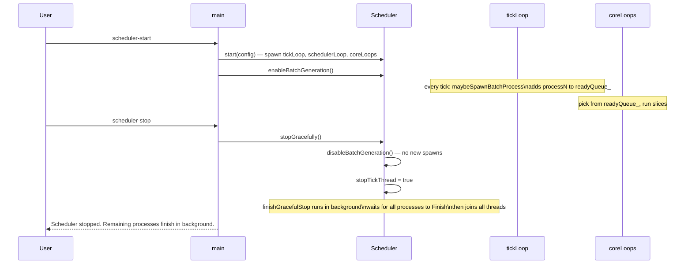
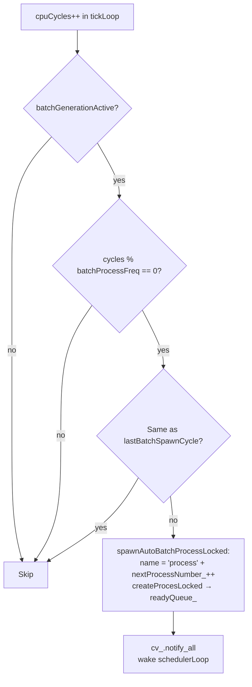

# F — Scheduler Implementation

## F.1 Thread Architecture

The scheduler runs three types of background threads simultaneously
while the main thread stays at the `root:\>` prompt.

---

## F.2 Data Flow Between Queues

How a process moves between the three queues during its lifetime.

---

## F.3 FCFS vs Round Robin

The only difference between the two scheduling modes is `quantumBudgetCycles()`.

---

## F.4 One RR Time Slice (runProcessSlice + runInstructionTree)

Detailed walk through executing one quantum on one core.

---

## F.5 scheduler-start vs scheduler-stop

---

## F.6 Batch Spawn Rate

`maybeSpawnBatchProcess()` fires on every `batchProcessFreq`-th CPU cycle.

