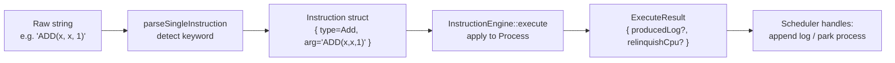
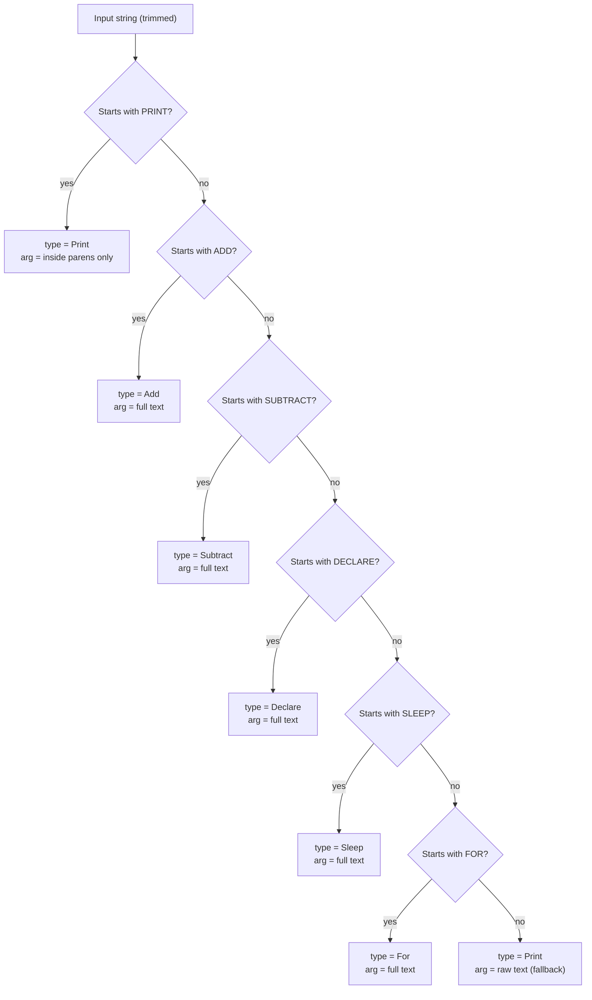
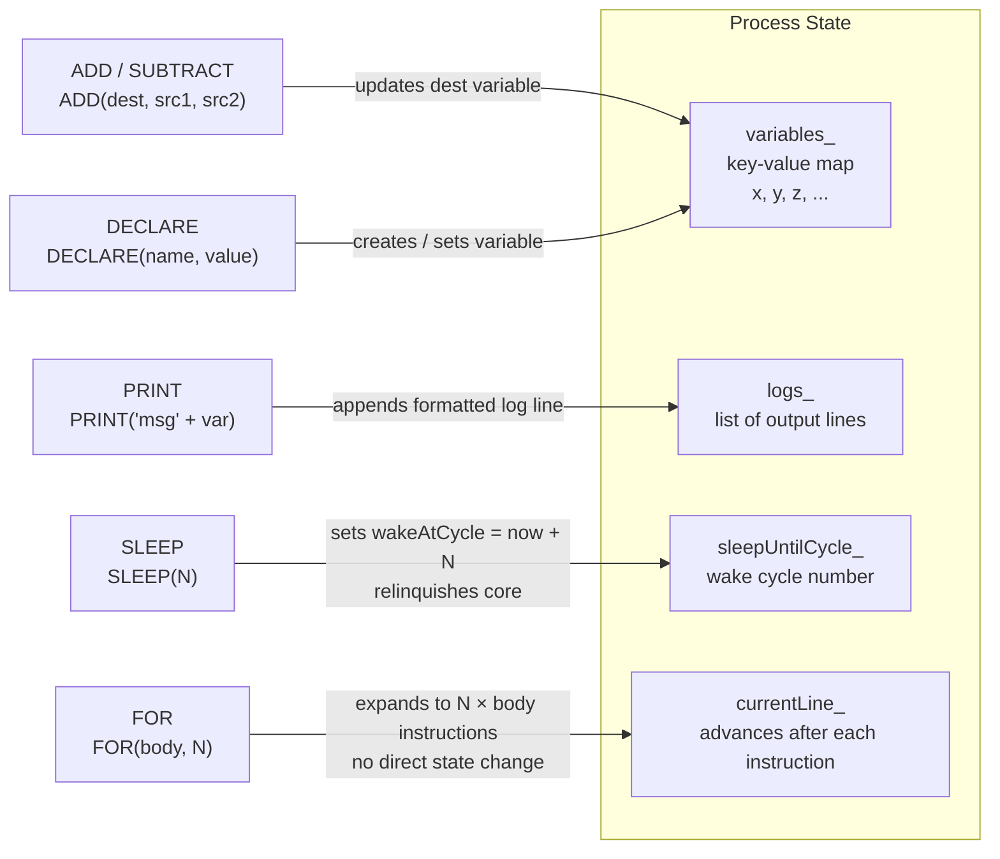
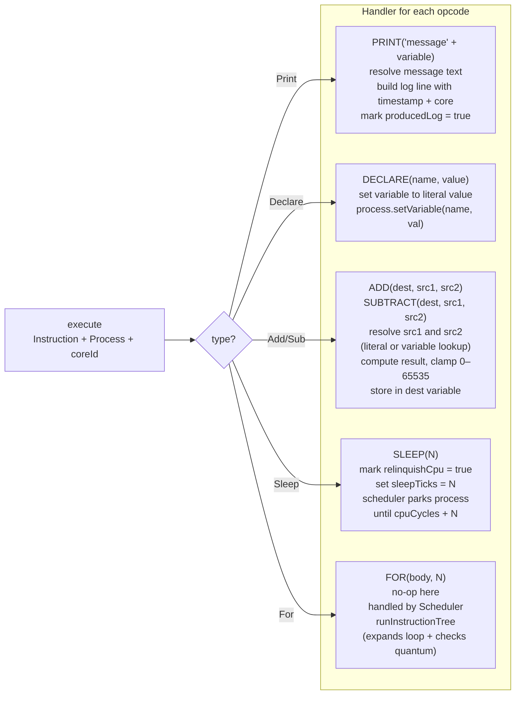

# G — Instruction Engine

## G.1 Parse → Execute Pipeline

Every instruction goes through two stages: parsing (text to struct) and
execution (struct applied to a Process).

---

## G.2 parseSingleInstruction Decision Tree

---

## G.3 How Instructions Affect a Process

Each instruction type modifies a different part of the process's data.
This shows what changes inside the Process object after each opcode runs.

---

## G.4 execute() Dispatch — Which Handler Runs

