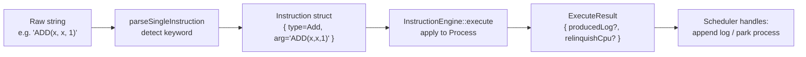
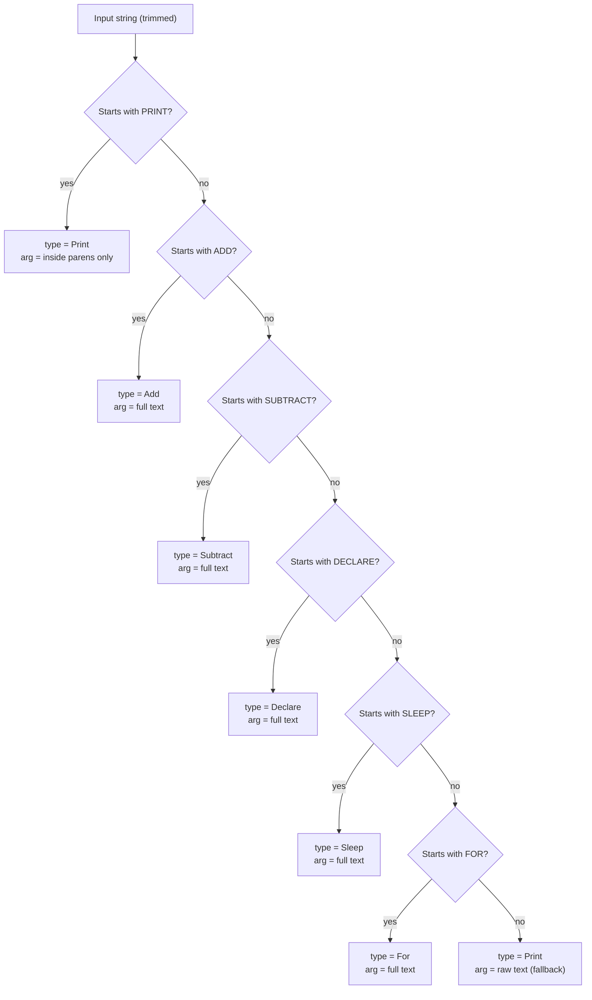
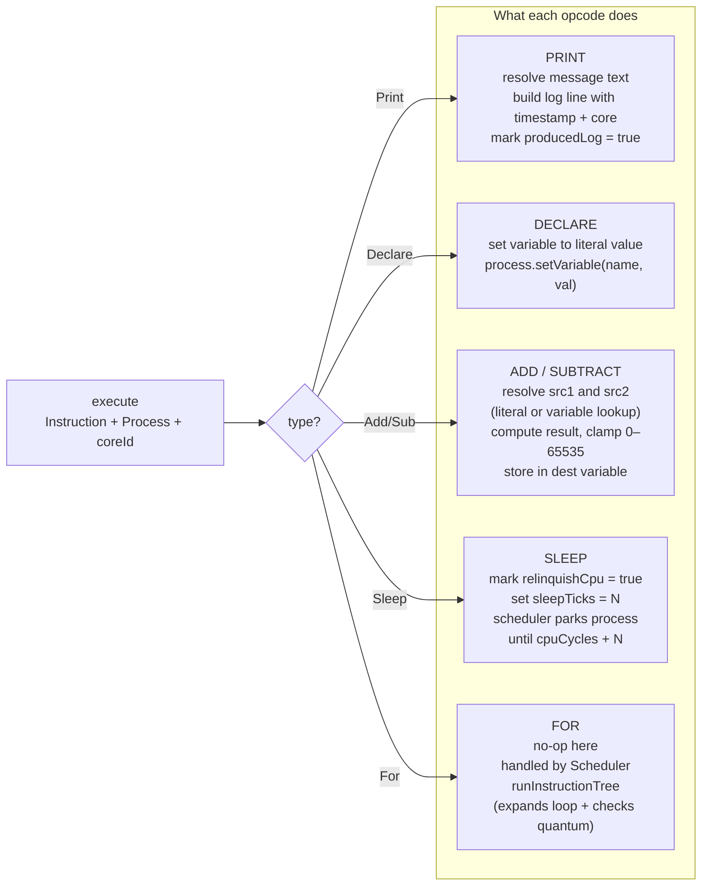

# G — Instruction Engine

## G.1 Parse → Execute Pipeline

Every instruction goes through two stages: parsing (text to struct) and
execution (struct applied to a Process).

---

## G.2 parseSingleInstruction Decision Tree

---

## G.3 execute() What Each Opcode Does

